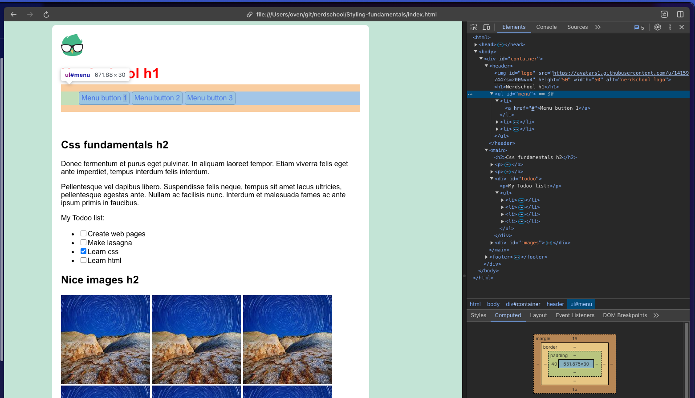

# Exercise 2 - Sizing and the box model
This exercise will focus on the sizing and box model of CSS, which will be important knowledge to have before delving into layouts.

You will learn about:
- Understanding how the box model affects sizing of elements
- Display properties
- Normal flow vs out of flow (abolute/fixed positioning)

## The Box model

The box model is a core concept of css which affects all HTML-elements that are displayed, by understanding the box model you will have a much easier time making layouts for webpages utilizing the different properties. The box model consists of content, padding, border and the margin.

### Content 
The inner layer that contains the contents of the target element. Content can consist of any type of HTML-element.
### Padding
Outside of the content layer is the padding. Adding space to the padding will give the visual effect of having space around the content.
You can give an element a 10px padding by typing: `padding: 10px`. Padding can also be given specific values such as this `padding-top: 10px` `padding-left: 25px` or the shorthand vertical and hortizontal syntax which is written like this: `padding: 0px 10px`. Or like this `padding: 10px 10px 10px 10px` for top, right, bottom and left padding.
### Border
The layer surrounding the padding layer. Many times this will have a small width of maybe only 1 pixel. Unlike the padding and margin, this property can be given color and style. and example of a faint thin grey border could be written like this: `border: 1px solid lightgray;`.

### Margin
The outermost layer between the target element and its parent element. Adding space to the margin will give the visual effect of pushing other close elements away with an invisible forcefield. Margins are written in the same style as padding. `margin-top: 10px`, or `margin: 15px 10px 20px 20px` for example.

:exclamation: Margins will overlap, so if two elements have the same margin of 20px that is pushing on eachother, they will overlap and the gap between them will only be 20px and not 40px.

## :pencil2: Box model Tasks
Keep editing `index.html` and `styles.css` from the previous exercise. 
Remember to ask if you are stuck on these tasks, also [MDN](https://developer.mozilla.org/en-US/docs/Web/CSS) is a good resource.  

#### Task 1
We want to make the header and the main content stand out from the page background. Set the background color for the entire
html document to `#c3e4d6`, and the background color of the `header` and the `main` elements to `white`. Also, add a
padding of 20 pixels to both.

#### Task 2
We want to make the edges of the content a bit neater. Add a border radius of 10 pixels to the top of the header and the bottom of the main element.
Feel free to play around with the values.

[Border radius on MDN](https://developer.mozilla.org/en-US/docs/Web/CSS/border-radius)

#### Task 3
Make the text in the footer centered.

## Display properties
The display property plays an important role in CSS, it decides how an HTML-element will behave in relation to other elements.
The most important display properties to learn are; none, inline, inline-block, block and flex.
For full details of display properties check out: [Display properties](https://developer.mozilla.org/en-US/docs/Web/CSS/display)

### None
`display: none` takes the whole HTML-element out of the document flow, that means that if you have multiple images for example, and you set them to `display: none` the container will collapse and shrink as if the element was never there. It will still be visisble in the HTML if you try to look for it though. 

:exclamation: A similar rule is `visibility: hidden`, it will hide items but not affect their presence in document, making the items still push on eachother while being invisible.

### inline
`display: inline` will make elements flow like text in a paragraph, (like ``). Any height and width properties will have no effect to it. Text and icons are common uses for display: inline.

### inline-block
`display: inline-block` will make an element display as an inline-level block container. The element itself is formatted as an inline element, but you can apply height and width values. Uses for inline-block can be pretty much anything that you want to not take up all available space and control the size of.

### block
`display: block` The block element will take up all horizontal space in the parent container, it will allways start on a new line from previous elements and stretch to the end of what confines it

## :pencil2: Display property tasks

We want to turn the menu unordered list into a menu with buttons, like this: 

#### Task 4 

The first task is to turn the `<li>` elements into inline block elements. You can select
them by using `#menu li { ... }`, meaning any `<li>` elements under the `#menu` element.

The result should look something like this: 

#### Task 5

Next, let's make the menu buttons look a bit more like buttons. You can achieve this by
using setting the properties `border`, `border-radius`, `padding` and `background-color` on the 
`li` elements. 

Try to make the buttons look a bit like this: 

#### Task 6
Use the inspector (right click the menu and select `inspect`) to figure out why there is a blank
space to the left of the menu. Write css to remove the white space. The trick is to identify the 
correct element to write css for.

#### Task 7

The links on the buttons are styled with blue color and underline, like normal links in 
the text. Since this is a menu, we want to remove the default styling and simply show 
the text without underline and in black color. 

Use the `text-decoration` property and the `color` property to make the link text
in the menu black with no underline. Make sure you don't accidentally also change the links 
in the text.

The result should look something like this: 

